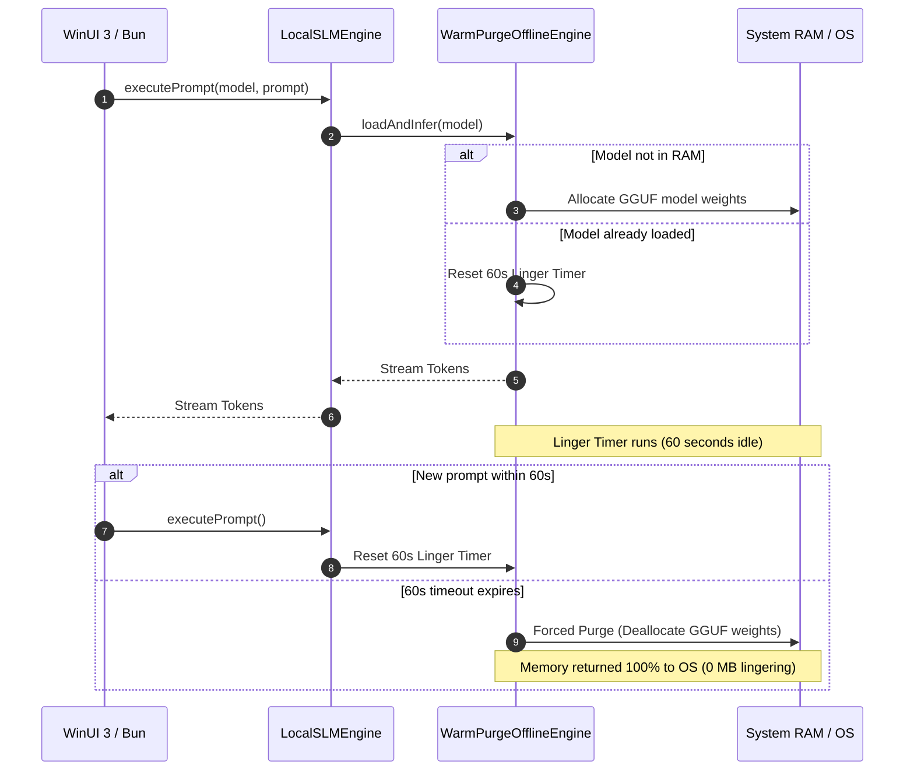
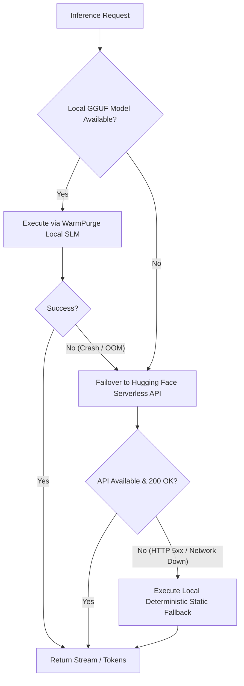
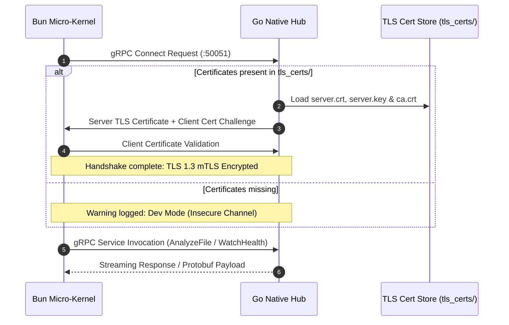
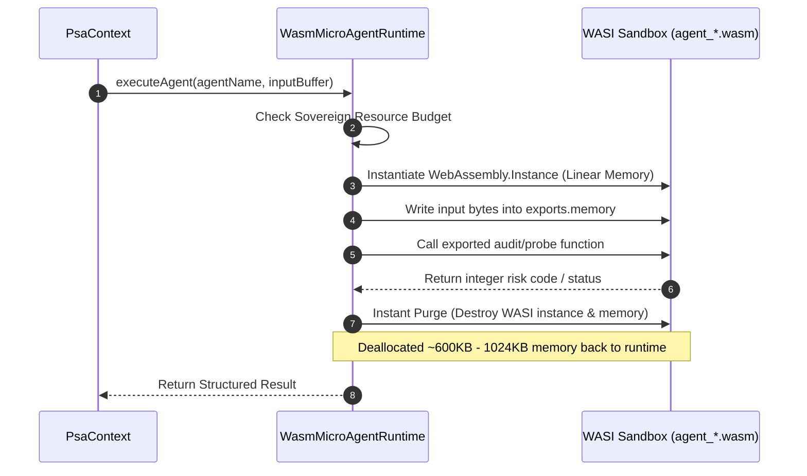
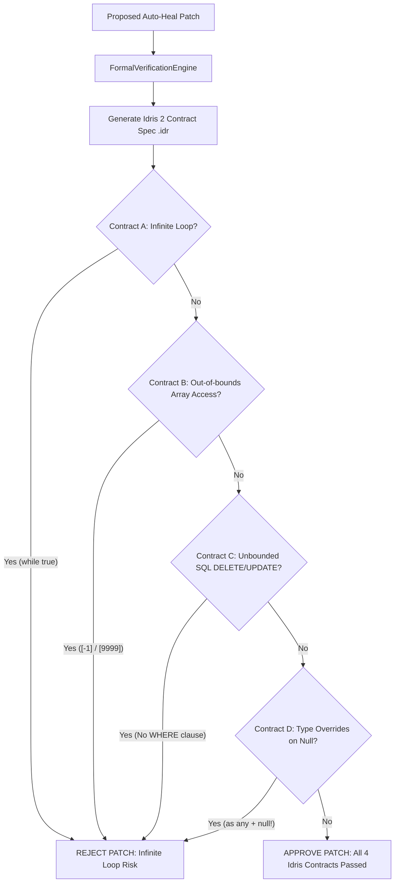

# Personas_Agentes (PSA) — Polyglot Sovereign Architecture

## Overview

Personas_Agentes (PSA) is a local-first, privacy-sovereign multi-agent AI execution platform. It spans a 6-language polyglot architecture engineered for high speed, zero cloud dependency, mathematical safety proofs, and strict resource containment.

```
┌───────────────────────────────────────────────────────────────────────────────────┐
│                           C# / WinUI 3 Desktop Client                             │
│                     Native Fluent UI • Direct SSE & REST IPC                      │
└─────────────────────────┬─────────────────────────────────────────────────────────┘
                          │ HTTP SSE / REST (:3080)
                          ▼
┌───────────────────────────────────────────────────────────────────────────────────┐
│                        TypeScript / Bun Micro-Kernel Orchestrator                  │
│               EventBus • PsaLLMService • WarmPurge • Plugin Engine                │
└─────────┬───────────────────┬─────────────────────┬───────────────────┬───────────┘
          │ gRPC / mTLS       │ C-ABI / bun:ffi     │ WASI Sandbox      │ Process / IPC
          ▼                   ▼                     ▼                   ▼
┌──────────────────┐┌──────────────────┐┌──────────────────┐┌──────────────────┐
│     Go Hub       ││ Rust SIMD Engine ││ WASM Micro-Agents││ Idris 2 Verifier │
│ TreeSitter / mTLS││ AST Complexity   ││ Zig Sandboxes    ││ Formal Proofs    │
└──────────────────┘└──────────────────┘└──────────────────┘└──────────────────┘
```

---

## Polyglot Stack & Responsibilities

| Subsystem | Primary Language | Directory | Key Responsibility |
|---|---|---|---|
| **Desktop Client** | C# (.NET 8 WinUI 3) | `src_native/winui/` | Native Fluent UI, zero WebView2 overhead, SSE stream rendering, Markdown cards |
| **Micro-Kernel** | TypeScript (Bun) | `src_local/` | EventBus dispatch, agent coordination, WarmPurge offline engine, HTTP REST/SSE server |
| **Native Hub** | Go 1.23+ | `src_native/hub/` | gRPC/mTLS RPC server, Tree-Sitter AST scanner, file system watcher, SQLite vault |
| **SIMD Analyzer** | Rust | `src_native/analyzer/` | Fast cyclomatic complexity, FNV1a hashing, C-ABI exports, graph dependency analysis |
| **WASM Micro-Agents**| Zig | `src_native/wasm_agents/` | Ephemeral sandboxed micro-agents (audit, security, git, telemetry, database, linter) |
| **Formal Safety Gate**| Idris 2 | `src_native/formal/` | Dependent-type formal proof checking (loop termination, array bounds, SQL invariants) |

---

## Critical Architectural Flows

### 1. SLM Warm-Purge Engine (Memory Management)

To guarantee local performance on consumer hardware without lingering VRAM/RAM consumption, the SLM Warm-Purge engine manages local GGUF models with a strict 60-second activity window before complete memory deallocation.



### 2. Cascade Failover Routing

PSA prioritizes offline local execution, seamlessly falling back to Hugging Face Serverless API, and finally to local deterministic static response generators if network or model errors occur.



### 3. Native Go Hub gRPC / mTLS Security Handshake

Inter-process communication between the Bun Orchestrator and the Go Native Hub uses gRPC protected by mutual TLS (mTLS) with TLS 1.3 when certificates are present.



### 4. WASM Micro-Agent Sandbox Lifecycle & Instant Purge

Zig micro-agents run inside ephemeral WASI WebAssembly sandboxes managed by `WasmMicroAgentRuntime`. Each invocation gets isolated linear memory and is immediately purged upon task completion.



### 5. Idris 2 Formal Safety Verification Gate

Auto-healing patches generated by PSA agents must pass dependent-type formal safety verification before code application.



---

## Reference Guide: 8 Super Personas

| Persona Plugin | Identifier | Focus & Tools | Primary Stack |
|---|---|---|---|
| **Strategic Cognitive** | `strategic_cognitive` | Strategic reasoning, phase decomposition (`strategic.decompose`) | Polyglot |
| **Audit Code** | `audit_code` | Code quality scorecards, complexity analysis (`code_auditor.scan`) | Polyglot / Rust |
| **Security Cloud** | `security_cloud` | SBOM generation, vulnerability scanning (`security.scan_sbom`) | Security / Cloud |
| **Architecture Types** | `architecture_types` | Type system invariants, structural depth (`architecture.inspect`) | TypeScript / C# / Rust |
| **Resilience Healing**| `resilience_healing` | Auto-repair patch generation (`auto_healer.repair`) | Polyglot / Idris 2 |
| **SysPerf** | `sys_perf` | System hardware profiling, RAM/CPU limits (`sysperf.profile`) | OS / Native |
| **Sync DevOps** | `sync_devops` | Git status reporting, conflict resolution (`devops.status`) | Git / CI |
| **UI/UX Architect** | `ui_ux_architect` | Trajectory digest formatting, native WinUI card specs | C# WinUI 3 |

---

## Reference Guide: 6 WASM Micro-Agents

| Agent | Source File | WASM Binary | Contract Function | Focus |
|---|---|---|---|---|
| **Audit** | `agent_audit.zig` | `agent_audit.wasm` | `audit_code`, `security_probe` | Silent catch detection, shannon entropy, dangerous eval/exec |
| **Security** | `agent_security.zig` | `agent_security.wasm` | `scan_vulnerabilities` | Hardcoded secrets, API tokens, SQL injection patterns |
| **Git** | `agent_git.zig` | `agent_git.wasm` | `analyze_commit` | Conventional commit validation, git conflict marker detection |
| **Telemetry** | `agent_telemetry.zig` | `agent_telemetry.wasm` | `collect_diagnostics` | System health diagnostics, memory pressure scoring |
| **Database** | `agent_database.zig` | `agent_database.wasm` | `inspect_query` | Unbounded query detection (missing WHERE/LIMIT), SQL safety |
| **Linter** | `agent_linter.zig` | `agent_linter.wasm` | `lint_source` | Polyglot code smell detection, long function detection |
